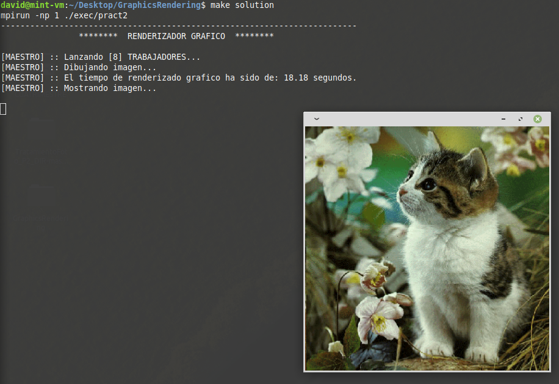

[![uclm](https://img.shields.io/badge/uclm-esi-red.svg?logo=data:image/png;base64,iVBORw0KGgoAAAANSUhEUgAAAA8AAAAPCAYAAAA71pVKAAAC9UlEQVR42o3S3UtTYRwH8F//QhBE3WT0elGr6CZUCLzoRUQt6ibICrESS1MDi7pJwcSXgsCGlG+1LFFzzpzONqduTp3TqVO36V7OzubZ2TznbDvn7NW5nmlXWdADPzg8/D6c3/N9HohSDPCrDgg53bDJByERj0OEpCCEE8cjXlrJaBbOcys2iHpp1OOBgN4MaG/b/BXHfKxgkwuaNvkQE6X8WNDiTI16qP/AicTlMElPeeXTtdTY7G1Kpa/iLU5dnONvhHDyH9hBJGEGu2RV2t93PWaXrb2xAO/kTJgMb5EUM9MGWZQJ5PrnTH9gMwYx2n865PLOrr5uK+XXcLV/YfUD3t5fFFgwN0Y89JzlTUcxb3PNc2YsjVHrdzAKBX1gh+KhsIXokgtJqbopxvIvEa7y600i38xSnXd4qpwa1zcTvcqGqNdHMBPzpzijHSDGcic2WV4Xj0QTGwptBd4meejTGb+gKcS+acMD1mj7Ro3OfcWE3fddnbJnKMRExMuYglbXWUCjjCTQitEBu2dQU05rFp6gsOrJftXzqI9d8gxpajzDk9XUqK6MVs+Xx9igLtnPmewz4GiRnEFprmxtbSXWO4crUCgVrs7hfDTyeLIpiBG29a6fBTxGlPkX116grQBrwnBHq+QCOD9LwflpQIDSNVAjM8IQSVWQfWN1lgZRQRLjH8WF7h5FJW9brww63I2c2WG0N/WkOUVSAHJADZ6BCXAIu/eiP9ehs79Do97xzxrbk5hdsYo9UlVejAnU0lOGFnvT932ubsW2A01WMUxml8Bo2l3QZD7ai+6wnLc5XyGnSuyslTC5UYOOUTJz/enBifR80GaXgjanDGAoJRMGU67Cj/0ZMJZ+DyzVrYdplT4PocXf2B4wWIrwVslJzcUCkB+4AiNHc1HlAMgFN7dr6EgWqC8VgrVeBI7mPkBPUZuUYfeGlehR7HGhbKYzi0F57BqMn7uVrN3Y9rYD0HMEontE4NMuK7yyyVS3WAmujqFd+Bcdh3NlWlsAggAAAABJRU5ErkJggg==&longCache=true&colorA=b30135&colorB=555555&style=for-the-badge)](https://www.esi.uclm.es)  

# Manual de usuario Práctica 2: Renderizado Gráfico
**Autor:** *David Camuñas*  

La compilación y ejecución se realiza de forma automática con el uso de la herramienta Makefile.

## Descripción
Esta práctica perteneciente al laboratorio de la asignatura de Diseño de Infraestructura de Redes (DIR) de ESI - UCLM.  
Se trata de un programa de renderizado gráfico, mediante el uso de funciones de ***MPI*** y ***MPI2***.  

Donde el programa se comenzará ejecutando con un único proceso (encargado de mostrar la imagen), proceso principal. Este proceso generará una serie de **N** procesos hijos (se encargarán del tratamiento de la imagen).

## Requerimientos
* Tener instalado *MPI*.

* Tener instalada la libreria *libx11*  
*$ sudo apt-get install libx11-dev*

## Creación de directorios necesarios
Con este comando se crearan los diferentes directorios entre ellos el directorio que contiene el archivo ejecutable del programa.  
***$ make dirs***  

## Limpieza de directorios
Este comando se ha utilizado para limpiar los directorios en los que se almacenan los ejecutables y las clases objetos (explicada anteriormente su creación).  
***$ make clean***

## Compilación
El proceso de compilación, se puede realizar de varias formas:  
* **Automaticamente con Makefile:** *$ make compile*   
 También con ***$ make all**** (se crearán los directorios necesarios y se compilará posteriormente)

* **Manualmente:** *$ mpicc src/toroidalNet.c -I include/ -lm -o exec/toroidalNet*  

Donde se puede observar la opción *-I include/* la cual define donde se encuentran las librerias propias (*definitions.h*). Y la opción *-lm* esta opción define la utilización de la libreria *-lX11*.

## Ejecución
Para la ejecución del programa se puede realizar al igual que la compilación de varias formas:  
* **Automaticamente con Makefile:** 
  * ***$ make solution*** (se mostrará la imagen original)  
  * ***$ make solution_sepia*** (se mostrará la imagen con filtro o tono sepia).
  * ***$ make solution_blackwhite*** (se mostrará la imagen en blanco y negro).
  * ***$ make solution_negativo*** (se mostrará la imagen donde cada pixel se mostrará con su color complementario).  
  
* **Manualmente:** *$ mpirun -n 1 ./exec/toroidalNet* 

## Resultado ejecución del programa

